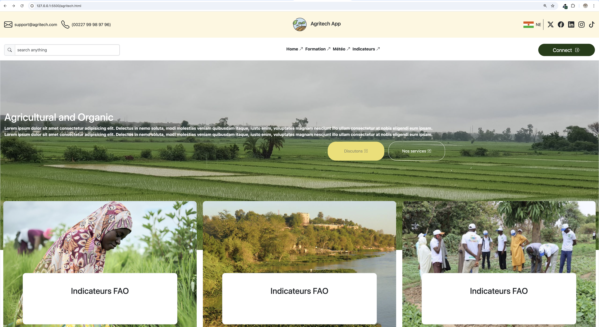
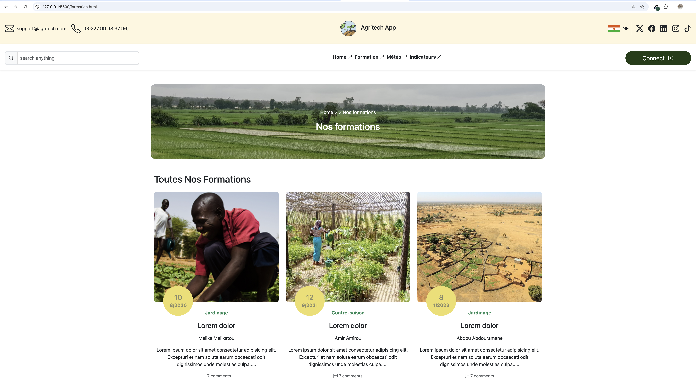
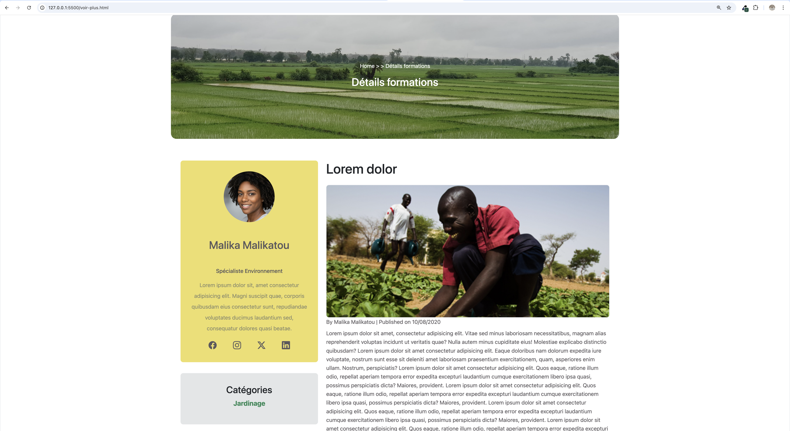

# Agritech — Plateforme Agricole de Formation

Ce projet consiste à concevoir un site web simulant une plateforme agricole destinée à offrir des formations, informations et services aux agriculteurs.
Il s’agit d’un exercice pratique permettant de se familiariser avec la conception d’interfaces web modernes et l’utilisation d'un framework CSS : Bootstrap.

## Objectifs du Projet

- Concevoir un site web responsive, adapté à tous les écrans.

- Mettre en place une interface utilisateur ergonomique et intuitive.

- Utiliser Bootstrap pour la mise en page, le grid system et les composants UI.

- Simuler un site réel proposant :

- des formations agricoles,

- une section météo,

- une partie indicateurs agricoles,

- une page d’accueil avec visuels,

- des éléments interactifs (hover, animations, etc.).
## Technologies utilisées
### Frontend

- HTML5

- CSS3

- Bootstrap 5 (grid system, components, utilities)

- Icons Bootstrap

- Responsive Design

### Outils additionnels

- VS Code

- Git & GitHub

### Fonctionnalités du site

_ Header responsive avec menu interactif

- Page d’accueil moderne (hero section + images + texte)

- Cartes informatives (indicateurs, météo, formations)

- Pages internes : Formation, Météo, Indicateurs

- Animations CSS (hover sur liens, images, icônes)

- Footer responsive avec effet hover

- Images adaptatives grâce à img-fluid

- Mise en page propre grâce aux utilities Bootstrap (spacing, flex, grid, colors...)

### Responsive Design

Le site utilise entièrement le système de grille de Bootstrap :

Écran	Breakpoint	Comportement
Téléphone	<576px	Colonnes empilées
Tablette	≥768px	2 colonnes
Laptop	≥992px	Mise en page élargie
Desktop	≥1200px	Layout complet

Les classes responsive utilisées :
col-12, col-md-6, col-lg-4, d-md-flex, text-md-start, gap-md-3, etc.

### Structure du Projet
agritech/
│── index.html
│── formation.html
│── meteo.html
│── indicateurs.html
│── assets/
│     ├── images/
│     ├── css/
│     │     └── style.css
│     └── js/
│── README.md

